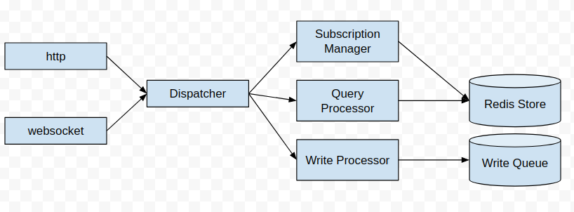
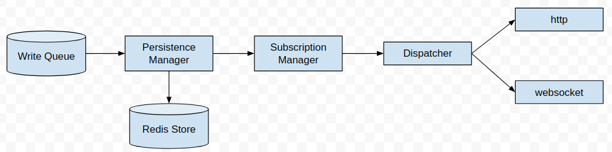

# Hogbase Server

## Data Storage
Data is stored in a tree, with branches and leaves.
A branch can hold a branch or a leaf. A leaf holds a value, which can be any JSON datatype.

Every database will have at least one root node, which can be a branch or a leaf.
Typically all root nodes will be branches, but both these and leaves are allowed.

## System Architecture

Hogbase Server consists of a number of modules that work together.

### Client Connections

A client can interact with the database using websocket or the HTTP API.
A request can be to read, write or subscribe to changes.

### Handling Incoming Requests

### Processing Writes and Notifying Subscribers

